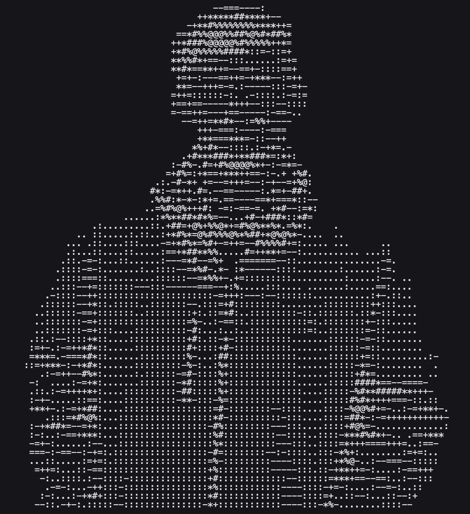

<pre><small><small>
long@github ─────────────────────────────────────────────

. OS: ................................. Fullstack Engineer
. Uptime: ...................................... est. 2018
. Host: ........................ Ho Chi Minh City, Vietnam
. Domain: ................... Fulbright University Vietnam

. Languages.Programming: ........ JavaScript, Python, Ruby
. Languages.Cloud: ............ AWS, Google Cloud Platform
. Languages.Real: .................... Vietnamese, English

. Hobbies.Software: ... AI Products, SaaS, Backend Systems
. Hobbies.Hardware: ................ Frisbee, Gym, Origami

─ Contact ───────────────────────────────────────────────

. Email.Work: ...................... longtn.work@gmail.com
. GitHub: ...................................... tnlong311

─ GitHub Stats ──────────────────────────────────────────

. Repos: .............................................. 10
. Commits: ........................................... 275
. Contributions.Annual: ............................ 2,400
. Lines of Code: ................. 200,809+++ / 114,064---
</small></small></pre>

 
